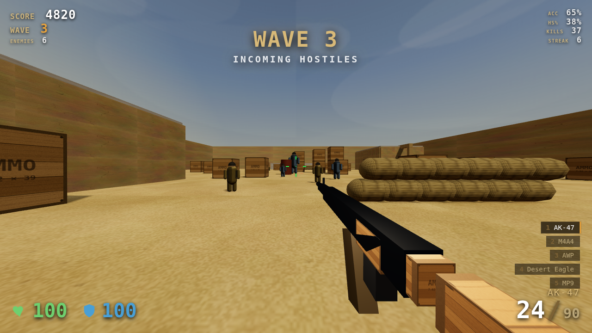

# 🎯 DUST STRIKE — Desert Aim Trainer

A browser-based, CS:GO/Dust2-inspired **FPS aim trainer**. Drop into a sandy
desert arena and fight endless **waves of bots** punctuated by **boss fights**,
with a full **loadout of guns**, procedural desert textures, and fully
**synthesized weapon audio** — all running in a single web page with no build
step and no external assets.

Everything is generated at runtime: textures are drawn on `<canvas>`, weapons
and enemies are built from procedural geometry, and every sound (gunshots,
reloads, hitmarkers, footsteps, boss roars, ambience) is synthesized with the
Web Audio API. The only dependency is [three.js](https://threejs.org), which is
vendored locally in `vendor/`.



## ▶️ Play it

The game uses ES modules + an import map, so it must be served over HTTP
(opening `index.html` from `file://` will not work). From this folder:

```bash
# Python 3 (built in on most systems)
python3 -m http.server 8000
# then open http://localhost:8000/ in a modern browser
```

or with Node:

```bash
npx serve .          # then open the printed URL
```

Click **CLICK TO PLAY**, then move your mouse to aim. Press **Esc** to release
the cursor / pause.

## 🎮 Controls

| Input | Action |
|-------|--------|
| `W A S D` | Move |
| `Mouse` | Look |
| `Left Click` | Fire (hold for automatics) |
| `Right Click` | Aim down sights / **scope** (AWP) |
| `R` | Reload |
| `1`–`5` / `Mouse Wheel` | Switch weapon |
| `Shift` | Walk (accurate) |
| `Ctrl` / `C` | Crouch |
| `Space` | Jump |
| `M` | Toggle background music |
| `Esc` | Pause / release mouse |

## 🔫 Weapons

Each weapon has its own damage, fire rate, magazine, recoil, spread and sound:

| # | Weapon | Type | Notes |
|---|--------|------|-------|
| 1 | **AK-47** | Rifle (auto) | High damage, one-shot headshots on light bots |
| 2 | **M4A4** | Rifle (auto) | Lower recoil, tighter spray |
| 3 | **AWP** | Sniper (bolt) | Right-click for the scope; huge damage |
| 4 | **Desert Eagle** | Pistol (semi) | Big hitting hand-cannon |
| 5 | **MP9** | SMG (auto) | Fast fire rate, run-and-gun |

Recoil kicks the view **after** the bullet leaves, so a well-placed first shot
always lands — real spray control matters for follow-ups. Moving, jumping and
firing all widen your spread (shown by the dynamic crosshair).

## 👾 Enemies, waves & bosses

- **Wave Survival** — clear each wave to advance; you heal a little between
  waves. Difficulty ramps every wave (more, tougher, faster bots).
- **Endless Rush** — waves flow with almost no downtime.

Bot archetypes: **Grunt** (baseline), **Rusher** (melee sprinter), **Marksman**
(accurate, keeps distance), **Heavy** (tanky). Every **5th wave is a BOSS wave**
— a Juggernaut, Desert Warlord or the melee Reaper, each with a health bar and
adds. Bots take **headshot / bodyshot / limb** damage multipliers, so precision
is rewarded.

## 📊 Aim-trainer stats

Live HUD tracks **accuracy**, **headshot %**, **kills**, and **kill streak**,
with a full end-of-run summary and a persisted **best score** per mode
(stored in `localStorage`).

## 🎵 Soundtrack

A generative **ambient Arabic-flute (ney)** soundtrack plays in the background —
also fully synthesized, no audio files. A slow, rubato melody wanders through
the **Hijaz maqam** (the Middle-Eastern scale with the signature augmented-2nd)
over a soft tonic/fifth drone, lush reverb, and a sparse deep frame-drum, so it
never loops audibly. It sits under the SFX and can be toggled with **`M`**.

## 🗂️ Project structure

```
csgo-aim-trainer/
├── index.html          # markup, import map, HUD + menu DOM
├── css/style.css       # HUD, crosshair, menus (CS-style desert theme)
├── js/
│   ├── main.js         # engine bootstrap, game loop, shooting, scoring, menus
│   ├── player.js       # first-person controller (move/jump/crouch/collision)
│   ├── weapons.js      # weapon stats + procedural gun viewmodels + recoil
│   ├── enemies.js      # bots, bosses, death FX, and the wave director
│   ├── map.js          # Dust2-inspired arena, colliders, spawns
│   ├── textures.js     # procedural canvas textures (sand, walls, crates, sky…)
│   ├── audio.js        # Web Audio synthesized SFX + ambience
│   ├── music.js        # generative ambient Arabic-flute (ney) soundtrack
│   └── hud.js          # HUD/stat DOM helper
└── vendor/             # three.js + PointerLockControls (local, no CDN)
```

## 🛠️ Tech notes

- **No image, audio, or model files** — every asset is procedural.
- **three.js r160** is vendored locally; the `three` bare specifier is resolved
  by an import map in `index.html`.
- Bullets use raycasting against enemy hitboxes (head/body/limb) and world
  cover; enemies do line-of-sight checks before firing.
- Tested headlessly (Chromium + SwiftShader) driving a full round: menu → wave
  spawns → shooting/headshots/kills → reload → weapon switch → boss wave, with
  no console or page errors.

> Not affiliated with or endorsed by Valve. "CS:GO" and "Dust2" are referenced
> only to describe the visual style; this project ships entirely original,
> procedurally generated assets.
